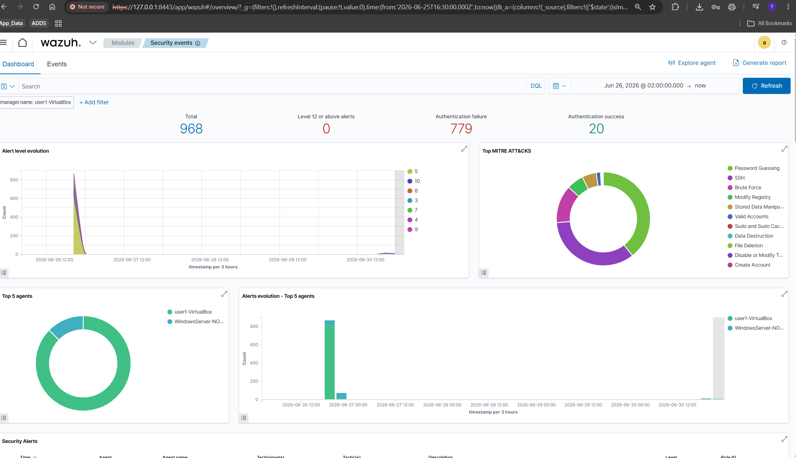
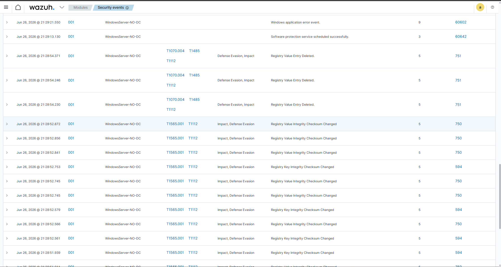

# Incident Investigation Report #002

**Date:** 26 June 2026
**Analyst:** Tarang Shah
**Severity:** High

---

## Executive Summary

On 26th June 2026, an attacker from Kali Linux (10.0.2.4) performed a brute force attack against Ubuntu's SSH service (10.0.2.15) using the Hydra password cracking tool. The attack generated 968 total alerts, including 779 authentication failures, before the attempt was manually stopped. No successful login occurred during the attack window, and no system compromise was achieved.

---

## Screenshots

**Dashboard Overview — Total Alerts:**

**Alert Detail — Rule ID and Timeline:**

## Timeline

| Time | Event |
|------|-------|
| Attack start | Hydra initiated attack against SSH service (port 22) on 10.0.2.15 |
| During attack | 779 authentication failure alerts generated (Rule 5760) |
| During attack | Repeated SSH connection failures detected by Wazuh |
| Attack end | Attack manually terminated (Ctrl+C) after generating 968 total alerts |

---

## Indicators of Compromise (IoCs)

| Field | Value |
|-------|-------|
| Attacker's IP | 10.0.2.4 (Kali Linux) |
| Victim IP | 10.0.2.15 (Ubuntu) |
| Attack type | SSH brute force password attack |
| Tool used | Hydra |
| Target port | 22 (SSH) |
| Target username | user1 |
| Wordlist used | rockyou.txt |
| Total alerts | 968 |
| Authentication failures | 779 |
| Rule ID triggered | 5760 |
| Protocol | TCP (SSH) |

---

## MITRE ATT&CK Mapping

| Technique ID | Technique Name | Tactic |
|-------------|---------------|--------|
| T1110 | Brute Force | Credential Access |
| T1021 | Remote Services | Lateral Movement |

**Kill Chain Phase:** Phase 4 — Exploitation (attempted)

---

## Analysis

- Attacker used Hydra to perform an automated password-guessing attack against Ubuntu's SSH service, attempting hundreds of passwords from the rockyou.txt wordlist against username "user1".
- Each failed login attempt generated a Wazuh alert (Rule 5760), resulting in 779 authentication failure alerts within a short time window.
- This high-frequency pattern of failed logins from a single source IP is a clear indicator of a brute force attack, distinct from normal user error (which typically produces only 1-3 failed attempts).
- The attack falls under MITRE ATT&CK technique T1110 (Brute Force) within the Credential Access tactic — the attacker's objective was to obtain valid credentials to gain unauthorized access.
- No successful authentication occurred during the observed attack window, indicating the attack failed before detection and termination.

---

## Containment Actions

- Block attacker IP (10.0.2.4) at the firewall level to prevent further brute force attempts.
- Review SSH logs on Ubuntu (10.0.2.15) to confirm no successful authentication occurred from the attacker IP at any point.
- Verify the targeted user account (user1) has not been compromised by checking for unusual login locations or times in the broader log history.
- Reset the password for the targeted account as a precautionary measure.

---

## Recommendations

- **Account Lockout Policy** — Implement an account lockout policy (e.g., lock account after 5 failed attempts) to limit the effectiveness of brute force attacks.
- **Fail2Ban** — Install Fail2Ban on Ubuntu to automatically block IP addresses after a threshold of failed SSH login attempts, stopping brute force attacks in progress.
- **SSH Key-Based Authentication** — Disable password authentication entirely for SSH and enforce key-based authentication, which is not vulnerable to password brute forcing.
- **Rate Limiting** — Configure SSH to rate-limit connection attempts per IP address, slowing down automated brute force tools significantly.
- **MFA for SSH** — Implement multi-factor authentication for SSH access to ensure that even a correctly guessed password is insufficient for unauthorized access.

---

*Incident Report #002 | Home SOC Lab | Analyst: Tarang Shah*
*Tools: Wazuh SIEM | Kali Linux (Hydra) | VirtualBox*
*Framework: MITRE ATT&CK — https://attack.mitre.org*
